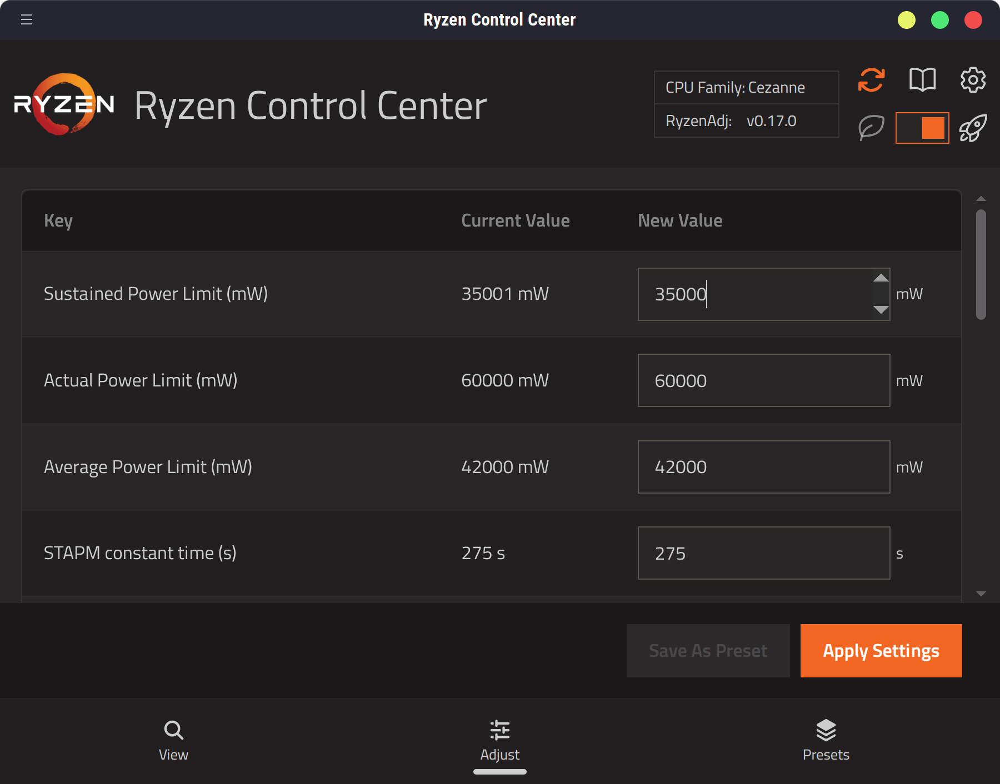

# Ryzen Control Center


Ryzen Control Center is a GUI frontend for [RyzenAdj](https://github.com/FlyGoat/RyzenAdj) on Linux (and maybe Windows, eventually).



The app is focused on being friendly and beautiful before being lean and mean. Thus, it is written in Electron. Yeah, sue me. I'm a web developer. All I have is this TypeScript-shaped hammer.

As I am likely to continue owning my Ryzen 5000 series laptop for quite some time, I do have loose long-term plans for a D-Bus daemon, [`ryzend`](https://github.com/queenkjuul/ryzend) (written in Go), which could be controlled by a small [python ayatana tray client](https://github.com/AyatanaIndicators/libayatana-appindicator-glib/blob/main/examples/simple-client-python.py) instead of a colossal hulking Electron app (that you have to admit, is at least pretty)

## About

Inspired by the now-deprecated [Ryzen Controller](https://gitlab.com/ryzen-controller-team/ryzen-controller), whose successor "Universal x86 Tuning Utility" is so universal that it does not run on Linux, and whose website commits the mortal sin of autoplaying a video with sound below the fold, and thus will not be mentioned again.

Built with Electron, Vite, React, Tailwind, and DaisyUI.

Development is focused on compatibility with latest Ubuntu, but the code is mostly platform-independent so a Windows version would be very little work (CI builds Windows binaries that run but are not actually wired to `ryzenadj` binaries)

## Features

### rice, rice, baby

Generate custom themes with the [DaisyUI Theme Generator](https://daisyui.com/theme-generator/) and simply paste them into the app. Use any DaisyUI theme you can find on the internet just as easily. Or, pick from any of the dozens of built-in themes.

more features probably coming eventually.


## Roadmap

### MVP

- [x] per-interaction admin authentication (sudo/UAC) for getting and setting `ryzenadj`
- [x] tray icon for showing current config and setting values\*
- [x] main window for editing current config and setting tray options\*\*
- [x] app runs with only tray icon after main window is closed
- [x] settings persistence
- [x] snap and AppImage packaging

\*Tray only allows setting PowerSave/MaxPerformance.

\*\*Tray does not actually expose any options for the main window to set, so, technically accurate (the best kind).

### Planned

- [ ] Full config presets
- [ ] In-app documentation for each parameter
- [x] Full light and dark mode support
- [x] `.deb` packaging

### Stretch

- [ ] `ryzenadj` snap packaging
- [ ] `ryzenadjd` systemd service to run with admin privileges (allow non-root settings adjustment)
- [ ] Integration with other power monitoring (e.g. show current battery draw, `powertop` interaction)
- [ ] `asusctl`/ROG Control Center integration
- [ ] Ubuntu PPA packaging
- [ ] `.rpm` packaging

## Usage

It should be straightforward. For details on various parameters, see the RyzenAdj docs.

### Log Level

By default, the "production" app logs at the `INFO (3)` log level. In development, it defaults to `SILLY (0)` (all messages).

To override the defaults, there are two flags:

- `DEBUG_LOG=true` - sets log level to `DEBUG (2)`
- `LOG_LEVEL=x` - sets log level to `x`, where `x` is a number 0-6:
  - 0: silly, 1: trace, 2: debug, 3: info, 4: warn, 5: error, 6: fatal

- [ ] TODO: Allow toggling `DEBUG_LOG` via the UI

### Ubuntu

Due to an incompatibility between Ubuntu 25+, Node.js, and polkit, sudo operations called from a Node process can hang for a long time.

The issue is being tracked on the polkit github: [#572](https://github.com/polkit-org/polkit/issues/572)

This can be worked around by setting a lower `ulimit -Sn` or `ulimit -Hn` value. The app will do this automatically if it detects it is running on Ubuntu 25+, or if either the `ULIMIT_S` or `ULIMIT_H` environment variables are set. These variables set the threshold value for each limit. If the system limit is above the threshold value, it will be clamped to the provided value. If the system value is below the threshold, it is not adjusted.

My system works fine with both clamping values set to `524288`, so that's the default. Values can be as low as `1024`.

**SETTING VERY LOW OR VERY HIGH VALUES MAY CAUSE SYSTEM PROBLEMS. I TAKE NO RESPONSIBILITY FOR YOUR SYSTEM. USE THIS SOFTWARE AT YOUR OWN RISK**

## Development

### Project Setup

#### Install

```bash
$ npm install
```

#### Development

```bash
$ npm run dev
```

#### Build

```bash
# For windows
$ npm run build:win

# For Linux
$ npm run build:linux
```

#### Code of Conduct

be nice, stay woke; be gay, do crime; live long, and prosper.

## License

(C) 2025 queenkjuul

Distributed under the terms of the GNU General Public License Version 3 (GNU GPL v3)

AMD, Ryzen, and the AMD logo are trademarks of Advanced Micro Devices, Inc.; this project claims no rights to these trademarks.
